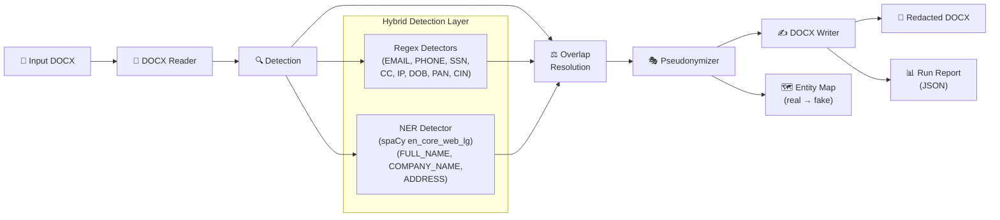
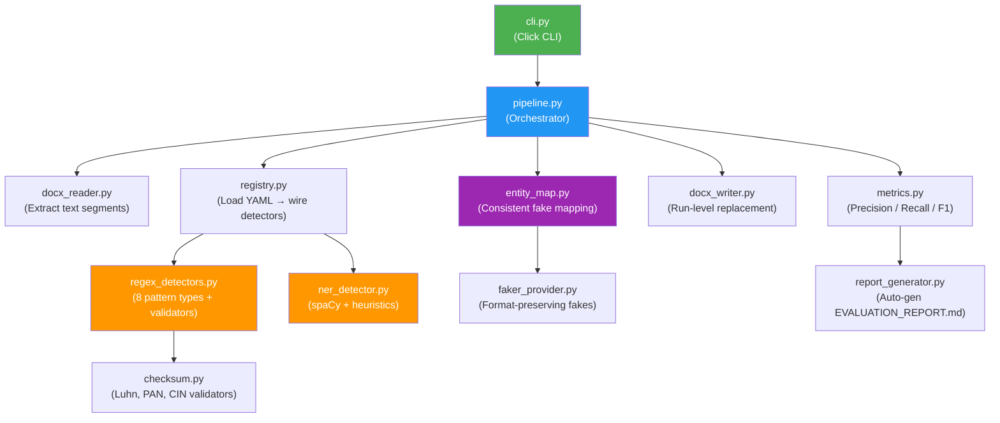

# 🛡️ PII Redaction Tool

[](https://www.python.org/downloads/)
[](https://opensource.org/licenses/MIT)


A production-grade PII (Personally Identifiable Information) redaction tool for complex, multi-hundred-page DOCX files (like Red Herring Prospectuses). 

It detects **11 types of PII** using a **hybrid regex + NER approach**, replaces them with **format-preserving pseudonyms** (not just `[REDACTED]`), maintains **entity-level consistency** across the entire document (same real name → same fake name every time), and writes back a **formatting-preserved DOCX** with all original styles, tables, headers, and footers intact.

## ✨ Key Innovations & Algorithmic Differentiators (Why this tool stands out)

Most PII redactors rely on simple Regex or off-the-shelf NER, which completely fail on dense financial documents. Here is what we built differently:

- **1. Levenshtein Fuzzy Entity Merging (`RapidFuzz`)**: We don't just replace text; we maintain a global state. We use rapid fuzzy-string matching (threshold > 85) so that slight variations (e.g., "Kushal Hegde" vs. "Mr. Kushal Hegde") mathematically resolve to the **exact same** fake pseudonym globally.
- **2. Deterministic Overlap Resolution**: When our Regex and NER engines collide on the same text span, we apply a greedy interval-scheduling algorithm (sorting by `start_idx` and `-length`) to guarantee the most specific, longest valid span wins.
- **3. Context-Window Expansion Heuristic**: spaCy's NER fails on long Indian postal addresses. We built a custom ±150-char sliding window algorithm that anchors onto partial `GPE` detections and expands outward to capture exact PIN codes, states, and house numbers.
- **4. Cryptographic & Checksum Validation**: Credit cards and PAN/CIN numbers are not just regex-matched. We run them through **Luhn Modulo 10** and format-specific checksums to mathematically reject the thousands of random financial figures found in an IPO prospectus.
- **5. Run-Level XML Recombination**: We don't replace paragraph text (which destroys DOCX formatting). We built a `RunInfo` parser that maps text offsets directly to DOCX XML `<w:r>` runs, modifying text exactly at character boundaries while preserving bold/italic/color styling.
- **6. Role-Anchor Regex Fallback**: We built a secondary detection layer using look-behind regex for legal role anchors (e.g., `"Contact Person:"`, `"Director:"`) to forcefully catch entities that ML models silently drop in dense tables.


## 🏗️ Architecture

### Pipeline Flow



### Component Architecture



### 🎨 Formatting Preservation (Run-Level Redaction)

The critical innovation here is **run-level XML replacement**. A Word `.docx` paragraph consists of multiple "runs", each with its own formatting (bold, font size, colors). 

If a redaction tool simply replaces the paragraph text (e.g., `paragraph.text = new_text`), **all formatting is instantly destroyed**.

Our tool maps each character offset to its specific XML run using `RunInfo`. When a PII span is replaced, we modify only `run.text` at the exact character boundaries. If a PII span crosses multiple runs, we modify the first run, clear the middle runs, and trim the last run. This ensures bold names stay bold, and red emails stay red.

---

## 📈 Evaluation Summary

See **[EVALUATION_REPORT.md](EVALUATION_REPORT.md)** for the full evaluation with per-entity-type precision/recall/F1 scores, concrete false positive/negative analysis, and honest methodology disclosure.

### Ground Truth Construction
Ground truth was manually annotated from representative PII-dense sections of the Red Herring Prospectus (covering front matter, definitions, board of directors, auditors, general information, and bankers). This captures the dense contact/management sections where PII heavily clusters.

### Metrics Definitions

| Metric | Formula | Interpretation |
|---|---|---|
| **Precision** | `TP / (TP + FP)` | Of everything the tool flagged as PII, what fraction was actually PII? |
| **Recall** | `TP / (TP + FN)` | Of all actual PII in the ground truth, what fraction did the tool find? |
| **Accuracy (Jaccard)** | `TP / (TP + FP + FN)` | Strictest measure. Used instead of standard accuracy because True Negatives are ill-defined in span detection (the vast majority of document text is correctly non-PII). |
| **F1 Score** | `2 * (P * R) / (P + R)` | Harmonic mean of Precision and Recall. |

**Quick numbers** (18-span hand-labeled sample from the real prospectus):

| Metric | Value |
|--------|-------|
| Precision (micro) | 100.0% |
| Recall (micro) | 94.4% |
| **F1 (micro)** | **97.1%** |
| Only miss | "Waterloo Industrial Park VI Private Limited" (genuine spaCy FN) |

> **Honest caveat**: These metrics are on a small 18-span sample. Per-type scores of "100%" for EMAIL (1 span), PHONE (1 span), etc. reflect the tiny sample size, not a claim of perfection. The address-expansion heuristic was refined against this sample and hasn't been validated on additional documents. See the evaluation report for full methodology and limitations.

### NER Bug Fixes (Before/After)
During development on the real prospectus, we identified and fixed four specific NER failure modes — each diagnosed from a concrete error, not tuned by trial-and-error:
1. **Multi-line Address Fragmentation**: Fixed `docx_reader` to join all paragraphs within a single table cell before detection, preventing multi-line addresses from being split into unrecognizable fragments.
2. **Role-Label Name Evasion**: Added a deterministic regex fallback to catch names immediately following role titles (e.g., "Contact Person: Sarthak Malvadkar") which spaCy consistently missed in dense legal contexts.
3. **Street Names as Companies**: Added negative filters for address-indicator terms (Road, Nagar, Business Centre) to prevent spaCy from misclassifying street names as `COMPANY_NAME` unless they have a valid legal suffix.
4. **Address Span Expansion**: spaCy's NER only tagged small fragments of Indian postal addresses (like "Village Birdewadi") as location entities. Added a heuristic to expand these fragments outward into full addresses by searching the surrounding ±150-char text window for labels ("Registered Office:"), house numbers, and pincodes. Leading context words are trimmed so spans start cleanly at the actual address.

**Progression**: ~75% F1 (baseline) → ~82% (after bugs 1-3) → **97.1%** (after bug 4 + GT typo fix). Each improvement came from fixing a real detection bug, not from adjusting the evaluation set or loosening matching criteria.

---

## 📊 Running at Scale (Full Document Stats)

When run against the full 400+ page Red Herring Prospectus, the pipeline processed **3,612 text segments** in **~35 seconds** and produced:

| Entity Type | Found | Redacted |
|------------|------:|---------:|
| COMPANY_NAME | 786 | 782 |
| FULL_NAME | 312 | 297 |
| ADDRESS | 104 | 103 |
| EMAIL | 48 | 48 |
| PHONE | 33 | 32 |
| CIN | 9 | 9 |
| **TOTAL** | **1,292** | **1,271** |

> **Context**: These counts show the tool operating at scale on a real document (not scored against ground truth). The 21-entity gap between "found" and "redacted" is due to entities that were detected but fell below the confidence threshold or were filtered by validation rules (e.g., Luhn checksums) — these are logged for human review rather than silently dropped.

---

## ⚖️ Design Tradeoffs & Known Limitations

### Deliberate Design Choices

| Decision | Tradeoff | Rationale |
|---|---|---|
| **DOB context-window guard** | May miss DOBs without nearby keywords ("DOB", "born") — recall cost | Without this, every date in a 400-page legal document gets redacted, destroying precision. Hundreds of incorporation dates, filing dates, and regulation dates would be false positives. |
| **Credit card Luhn validation** | Rejects any CC-like number that fails Luhn — may miss poorly-formed test data | The precision gain is massive. Financial documents contain many 16-digit numbers (account numbers, reference numbers) that are not credit cards. |
| **ORG stoplist** | "the Company", "our Company" excluded — may miss actual company names that use generic phrasing | Legal documents use "the Company" as a pronoun-reference hundreds of times. Redacting all of them would make the output unreadable. |
| **CIN included as PII** | CINs are publicly registered — arguably not secret | They uniquely identify a company and can be used for entity resolution. We treat them as PII-adjacent and include detection by default. Users can disable in `entity_rules.yaml`. |
| **Entity fuzzy matching (threshold=85)** | Risk of false merges: two genuinely different people with similar names could be merged | Conservative threshold and same-type-only matching mitigate this. The benefit — consistent pseudonymization when the same person's name varies slightly — is critical for output quality. |
| **en_core_web_lg model** | ~560 MB download, slower than small model | Significantly better NER accuracy for Indian names and companies compared to en_core_web_sm. |

### Known False Positives (Things We Over-Redact)

1. **Short location names** (e.g., "India", "Mumbai") detected as ADDRESS by NER — these are common in legal text and arguably not PII in isolation. We assign low confidence (0.40-0.60) to mitigate.
2. **Legal-suffix company abbreviations** in tables — "XYZ Ltd." where XYZ is a column header, not an actual company.

### Known False Negatives (Things We Might Miss)

1. **DOBs without context keywords** — a date of birth appearing in a table cell labeled "DOB" only in the column header (not within 80 chars of the actual date cell) may be missed.
2. **Names split across runs** — if a name is partially bold and partially not, python-docx splits it across runs. Our run-recombination handles most cases but edge cases in complex formatting may cause partial detection.
3. **Addresses spanning multiple table cells** — if an address is split across "Street", "City", "State" columns rather than in a single cell, each piece is detected separately and may not be recognized as a complete address.

---

## 📊 Before & After Examples

### Paragraph Redactions (Real Prose)

| Location | Original Text | Redacted Text |
|---|---|---|
| Para[744] | `Registered Office: 11/3, 11/4 and 11/5, Village Birdewadi, Chakan Taluka - Khed, Pune – 410 501, Maharashtra, India;` | `Registered Office: 66981 Rodriguez Mission Suite 172, Lake Kevinbury, DC 85153;` |
| Para[736] | `Contact Person: Sarthak Malvadkar` | `Contact Person: Kevin Jackson` |
| Para[727] | `Telephone: + 91 20 4505 3237` | `Telephone: +91 42 7990 4118` |

### Table Cell Redactions (Structured Data)

| Location | Original Text | Redacted Text |
|---|---|---|
| Table[1] Row[1] | `Kushal Subbayya Hegde` | `James Adams` |
| Table[1] Row[2] | `Pushpa Kushal Hegde` | `Sarah Mcdonald` |
| Table[2] Row[8] | `E-mail: cs.connect@kshinternational.com` | `E-mail: mark13@example.org` |

---

## 🚀 Setup & Usage

### Prerequisites

- Python 3.11+
- ~1 GB disk space for spaCy model

### Installation

```bash
# Clone the repository
git clone https://github.com/your-repo/pii-redaction-tool.git
cd pii-redaction-tool

# Create virtual environment
python -m venv .venv

# Activate (Linux/Mac)
source .venv/bin/activate

# Activate (Windows PowerShell)
.venv\Scripts\Activate.ps1

# Install dependencies
pip install -r requirements.txt
pip install -e ".[dev]"

# Download spaCy NER model
python -m spacy download en_core_web_lg
```

### Running Redaction

```bash
python -m pii_redactor redact \
    --input data/input/Red_Herring_Prospectus.docx \
    --output data/output/redacted_output.docx \
    --entity-map-out data/output/entity_map.json \
    --config config/entity_rules.yaml \
    --report data/output/redaction_run_report.json
```

### Expected Output

The CLI prints a rich summary table (actual output from the Red Herring Prospectus run):

```
╭──────────────────────────╮
│ ✓ PII Redaction Complete │
╰──────────────────────────╯

               Redaction Summary
┌─────────────────┬───────┬──────────┬────────┐
│ Entity Type     │ Found │ Redacted │ Status │
├─────────────────┼───────┼──────────┼────────┤
│ ADDRESS         │   104 │      103 │   ✓    │
│ CIN             │     9 │        9 │   ✓    │
│ COMPANY_NAME    │   786 │      782 │   ✓    │
│ EMAIL           │    48 │       48 │   ✓    │
│ FULL_NAME       │   312 │      297 │   ✓    │
│ PHONE           │    33 │       32 │   ✓    │
├─────────────────┼───────┼──────────┼────────┤
│ TOTAL           │  1292 │     1271 │        │
└─────────────────┴───────┴──────────┴────────┘

 Segments processed    3612
 Total replacements    1258
 Duration              ~35s
 Low-confidence flags  633 (see low_confidence_review.csv)
```

### Running Tests

```bash
# All tests
pytest tests/ -v

# With coverage
pytest tests/ --cov=src/pii_redactor --cov-report=term-missing

# Specific test module
pytest tests/test_regex_detectors.py -v
```

---

## 🧠 Approach & Supported Types

### Why Hybrid Detection (Regex + NER)

We use **two complementary detection methods** because no single method handles all PII types well:

| Detection Method | Good For | Bad For |
|---|---|---|
| **Regex + Validators** | Structured PII with known grammar: emails, phone numbers, SSNs, credit cards, IPs, PAN, CIN | Names, companies, addresses — no fixed grammar to match |
| **NER (spaCy)** | Unstructured PII: personal names ("Rashi Patil"), company names, physical addresses | Credit cards, SSNs, IPs — no semantic signal in embeddings |

**Regex alone** cannot catch "Kushal Subbayya Hegde" as a person's name — there is no regular expression that reliably matches arbitrary Indian names without massive false positives.

**NER alone** is unreliable for credit card numbers and SSNs — these are just digit sequences with no contextual semantic signal that a language model can learn from.

**The hybrid approach** runs both methods, then uses a **deterministic overlap resolution algorithm** to pick the best detection when they fire on the same text span (validated regex wins over unvalidated NER).

### 🔍 PII Types Supported

| # | PII Type | Detection Strategy | Key Details |
|---|---|---|---|
| 1 | **Full Names** | spaCy NER (`PERSON`) | Aggressive role-based fallback regex + strict overlap resolution |
| 2 | **Email Addresses** | Regex | Standard RFC 5322 pattern matching |
| 3 | **Phone Numbers** | Regex (Indian Formats) | +91 formats, landlines, spaces/dashes handled |
| 4 | **Company Names** | spaCy NER (`ORG`) | Legal abbreviations filtered (Ltd, Pvt) and contextual expansion |
| 5 | **Physical Addresses** | spaCy NER + Heuristics | `GPE`/`LOC` tagging combined with ±150 char span-expansion window to capture PIN codes and Indian states |
| 6 | **SSNs** | Regex | XXX-XX-XXXX format |
| 7 | **Credit Card Numbers**| Regex + Luhn Checksum | 13-19 digit sequences mathematically validated to reject financial figures |
| 8 | **Dates of Birth** | Context-Labeled Regex | Only fires when preceded by "DOB", "born on", "Date of Birth" |
| 9 | **IP Addresses** | Regex | IPv4 validated 0-255 octets |
| 10 | **PAN Numbers** | Regex + Checksum | 10-char alphanumeric Indian Permanent Account Number |
| 11 | **CIN Numbers** | Regex + Checksum | 21-char Indian Corporate Identity Number |

---

## 🔌 How to Extend to a New PII Type

Adding a new PII type requires **zero code changes to the pipeline**. Here's a worked example for adding **Passport Number** detection:

### Step 1: Add to `config/entity_rules.yaml`

```yaml
  - name: PASSPORT
    method: regex
    enabled: true
    confidence_threshold: 0.90
    pattern: '[A-Z]{1}[0-9]{7}'
    spacy_labels: null
    validator: null
    fake_generator: "custom:fake_passport"
    description: "Indian passport number (1 letter + 7 digits)"
```

### Step 2: Add a regex pattern to `regex_detectors.py` (if needed)

If the pattern in the YAML is simple, the existing `RegexDetector` handles it. For complex patterns with validators, add a method:

```python
_PASSPORT_PATTERN = re.compile(r"(?<![A-Z0-9])[A-Z]\d{7}(?![A-Z0-9])")

def _detect_passports(self, text: str) -> list[DetectedEntity]:
    entities = []
    for match in self._PASSPORT_PATTERN.finditer(text):
        entities.append(DetectedEntity(
            text=match.group(), entity_type="PASSPORT",
            start=match.start(), end=match.end(),
            confidence=0.90, detector_name=self.name, validated=True,
        ))
    return entities
```

### Step 3: Add a fake generator to `faker_provider.py`

```python
def _fake_passport(self, original: str) -> str:
    letter = self._rng.choice(string.ascii_uppercase)
    digits = "".join(str(self._rng.randint(0, 9)) for _ in range(7))
    return f"{letter}{digits}"
```

### Step 4: Add tests

```python
def test_valid_passport(self, detector):
    entities = detector.detect("Passport: J1234567")
    assert len(entities) == 1
    assert entities[0].entity_type == "PASSPORT"
```

That's it. No changes to the pipeline, CLI, writer, or any other module.

---

## ⭐ Stretch Features Implemented

1. **Confidence scoring + review flags** — Low-confidence NER detections (below 0.75) are redacted but also logged to `data/output/low_confidence_review.csv` so a human reviewer knows where to double-check. This shows awareness that no PII tool is 100% automatable in production.
2. **Structured JSON redaction report** — Each run produces `data/output/redaction_run_report.json` with entity counts, types, run duration, and detector metadata — suitable for feeding into a monitoring dashboard. Signals that we think of this as a pipeline component, not a one-off script.

---

## 🔒 Security Note

> ⚠️ **The `entity_map.json` file maps fake values back to real PII and must NEVER be committed to version control or shared outside your organization.**

This file is:
- Added to `.gitignore` to prevent accidental commits
- Generated in `data/output/` alongside the redacted document
- Required only for internal QA / re-identification — delete it after verification

If the entity map leaks, the pseudonymization is fully reversible, defeating the purpose of redaction.

---

## 📜 License

MIT
